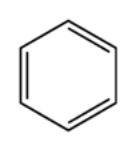
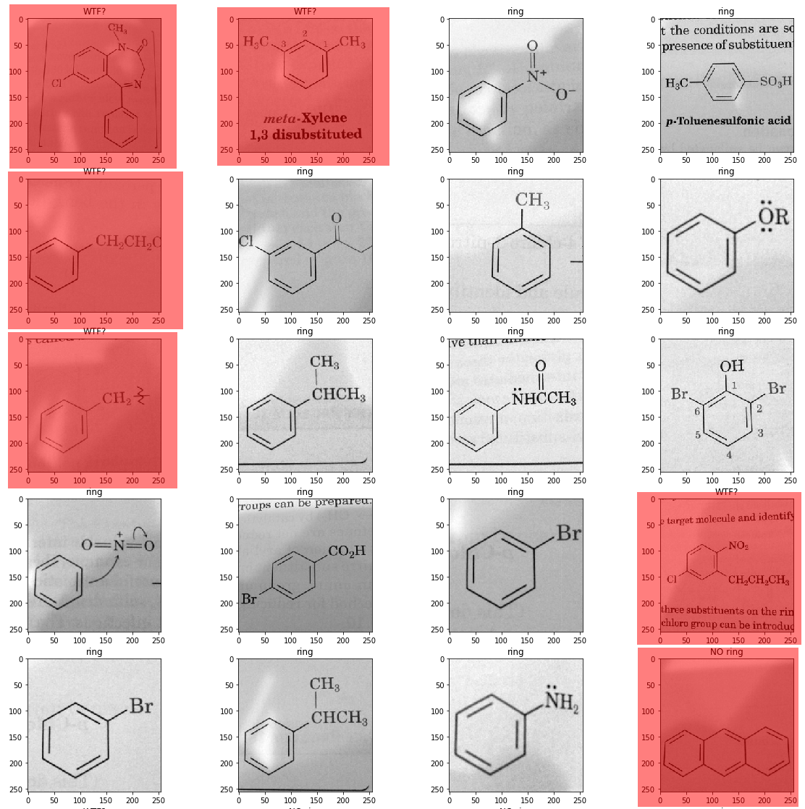

# organicml

This project is an attempt to classify chemical diagrams using a convnet. The convnet is supposed to recognize the following structure within each diagram and classify the structure as present or not present:

The picture below is how it classified the images--not all of them successfully. The images highlighted in red were misclassified. (WTF? means the classifier was confused about what they should be classified as).

That is just a sample of all the images that were attempted. If you want to see all the images, open the [first attempt](first_attempt.ipynb) notebook.

Ultimately, the project was hindered by a lack of available images. At most, I had 200 images with the benzene ring and 200 without. That is 400 examples, and about as much as an undergraduate would have in their first organic chemistry course to learn with. I got the net up to about 65% accuracy--not great, but for just 400 images?

If I were to continue, I would need to find a way to get a lot more images.